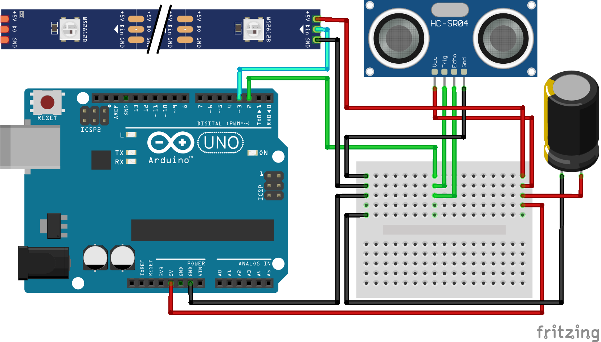

# Parking Helper

I struggled to park my car with just enough room to let me scoot around it in the front, so I built this helper.  Only after I showed it off did someone tell me I could have just hung a tennis ball by a string...  
  
An ultrasonic sensor detects when the car is being parked and fills a bar of LEDs proportional to the remaining distance.  Once parked, it turns the lights off until the car has left and returned.  
  
 
 

  
Image created with [Fritzing](https://fritzing.org/).